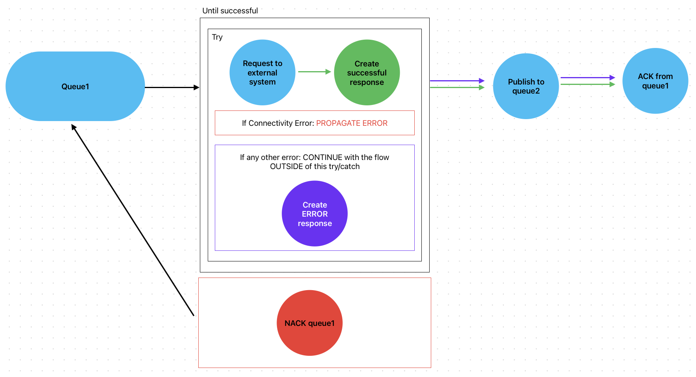

# My process API Munits

**2024**

Code demonstrated at the [Anypoint MQ and MUnits with Alex!](https://www.twitch.tv/videos/2121384816) live stream on Apr 16, 2024.

**2021**

Code demonstrated at Online Spanish MuleSoft Meetup: [Demo: Creando pruebas unitarias para una API de proceso](https://meetups.mulesoft.com/events/details/mulesoft-online-group-spanish-presents-demo-creando-pruebas-unitarias-para-una-api-de-proceso/) on Jan 13, 2021.

## Similar repos

## Diagram

This diagram was created during the [Anypoint MQ and MUnits with Alex!](https://www.twitch.tv/videos/2121384816) live stream on Apr 16, 2024.

## The flows

In summary, the main flow has a Subscriber to `queue1`. Once the message is processed, it's attempted to be sent in an HTTP Request to an **HR API**. The issue with this external API, is that it's not reliable and is often down. So, the code challenge was to be able to create a flow that could retry to send the RQ n amount of times before sending the message back to the queue. This was solved with an **Until Successful**.

The second issue is that not all errors should be interpreted or processed the same way. If the API returned a Connectivity error, the flow is supposed to keep trying. But what if it's not a connectivity error and it's a bad request or an internal server error? Then we don't want to keep trying with the same request over and over again. We want to discard it and send an error to the `queue2`.

For this, an Error Continue needed to be put in place.

Now if the error is indeed a connectivity issue, then the error is returned with the **On Error Propagate** to the Until Successful so it can be tried again. But if the error is anything else, like a bad request, then the message is processed as an Error Response and is sent to the `queue2`.

This way, the Until Successful won't be tried again because the message is interpreted as a successful response, but the payload contains the error message.

## The tests

### Happy Path

The first test makes sure the happy path is working properly.

There is a bunch of `Verify call` components that help us make sure certain components are executed exactly the number of times they're supposed to be executed. We also have `Mock`s for the calls to external systems, including Anypoint MQ.

As you can see, none of the On Error Propagate/Continue were executed.

### Bad Request

As we learned from the description of the flows, we only want to keep trying to call the API if the error is a connectivity error. If not, we want to acknowledge the message from the queue and send the error response to the `queue2`.

This test is a lot like the previous one. But take a look at the `Verify Call`s. Their numbers change.

Now instead of creating the successful response, the flow went to the On Error Continue to create the error response and send it to `queue2`.

### Connectivity Issues 1

In this test, we are mocking the connectivity error from the API call so we can make sure that the Until Successful is exhausted and the queue message is being put back into the queue with the NACK.

As you can see, there are no assertions in this test. That is because we are expecting an error back from the main flow. Once the error reaches the test, the assertions are not executed. So how do we know this is the expected error? By configuring the error as expected from the test's configuration:

This way, we are expecting to receive the `RETRY_EXHAUSTED` error from the Until Successful.

### Connectivity Issues 2

Another way to test the same error scenario, but with actual assertions, is with the Try/Catch scope.

This way, we are still making sure the `RETRY_EXHAUSTED` error is correctly being returned (and nothing else), and we are able to actually run some validations. Like making sure the API request and the On Error Propagate are being executed exactly 3 times (because of the Until Successful settings).

